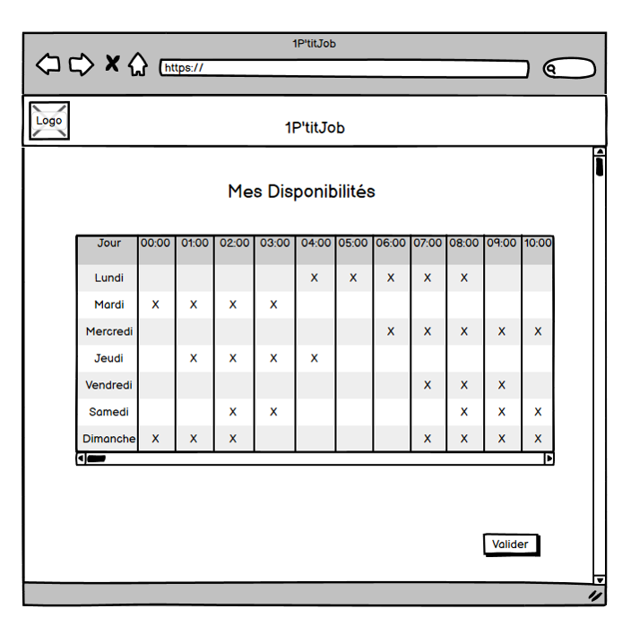

# S3.SAE

**Pitch de notre application web :**
1P’titJob est un site qui a pour but d’aider les jeunes étudiants à trouver un petit boulot. Grâce à cette application, les étudiants pourront d’ores et déjà commencer à s’insérer dans la vie professionnelle tout en conciliant travail et études. Elle va leur permettre de trouver un job adapté à votre emploi du temps, même pour moins d'une dizaine d'heures par semaine, à travers des échanges directs avec l’entreprise. 

1P’titJob profite à tout le monde, que ce soit aux étudiants ou à l’entreprise elle-même. Grâce à une méthode de communication nous pouvons mettre directement en relation les deux camps. Ensuite, elle a pour but d’aider les étudiants à trouver du travail plus facilement en fonction de leur emploi du temps. 

1P’titJob apporte tout d’abord de l’expérience professionnelle, qui va permettre aux étudiants d’acquérir des compétences grâce à leur travail. L’application a aussi pour objectif de réduire la précarité chez les étudiants, ce qui, grâce à un salaire, permet aux étudiants de boucler leurs fins de mois par exemple. 1P’titJob aide à lutter contre l’isolement, puisqu’un emploi favorise l’insertion sociale. Et enfin, elle vient aussi en aide aux entreprises ayant un besoin en personnel, disponibles à certaines heures, les étudiants leur permettraient de combler un sous-effectif à cette heure-là. 

**Pitch de notre problème algorithmique :**
Lorsqu'une entreprise dépose une offre d'emploi et que de nombreux étudiants y répondent, la question est : 

Comment trouver la combinaison d'étudiants la plus optimale afin de répondre au mieux aux horaires de l'offre ? 

Afin de répondre à cette question, nous proposons aux entreprises une fonctionnalité leur permettant de lister toutes les combinaisons possibles, de la plus optimale, càd qu'elle répond le mieux aux critères choisis, à la moins optimale. 

Les critères pour l’entreprise sont : 

- le nb minimum d'étudiants sélectionnés par jour d’offre 

- le nb minimum d'étudiants total sélectionnés sur toute la durée de l’offre 

- le nb minimum d'heures par jour d’offre que doit faire un étudiant 

- si la répartition des heures entre les étudiants sur un jour d’offre vise à être égale ou inégale (càd environ ou pas le même nombre d’heures par étudiant sur un jour d’offre) 

Si plusieurs combinaisons ayant le même taux de satisfaction ressortent, elles seront listées à la suite (ex-aequo) avec un indice. 

**Maquettes du problème algorithmique :**  
  
Figure 1 : planning_Etudiant
  
Figure 2 : info_Offre_Entreprise
  
Figure 3 : candidature_Offre_Entreprise
  
Figure 4 : combinaison_Candidature_Offre_Entreprise

**Organisation du Github :** 
- un dossier Spécification contenant les Spécifications Externes du Problème Algorithmique que vous traitez;
- un dossier Algorithme contenant votre Algorithme et son Dictionnaire;
- un dossier src qui héberge le Code correspondant à votre Algorithme;
- un dossier docs qui contient la documentation Doxygen de votre code source.
- un dossier maquettes contenant les maquettes du problème algorithmique

**Espaces de travail :**  
Voici également les différents espaces de travail du projet qu'on utilise :
  - OneDrive 
  - Teams
  - Trello

**Membres :**  
Les membres du projet sont :
  - KISS Lucas (Lucas-kiss)
  - BÉGUINEL Kévin (Kevin-BEGUINEL)
  - CONSTANS Fanny (fannyyc)
  - DE BRITO Luca (LucaDeBrito)
  - AUDOUARD Raphaël (FlocAud)